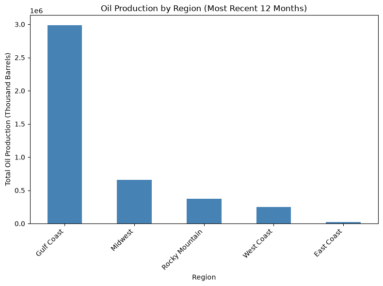
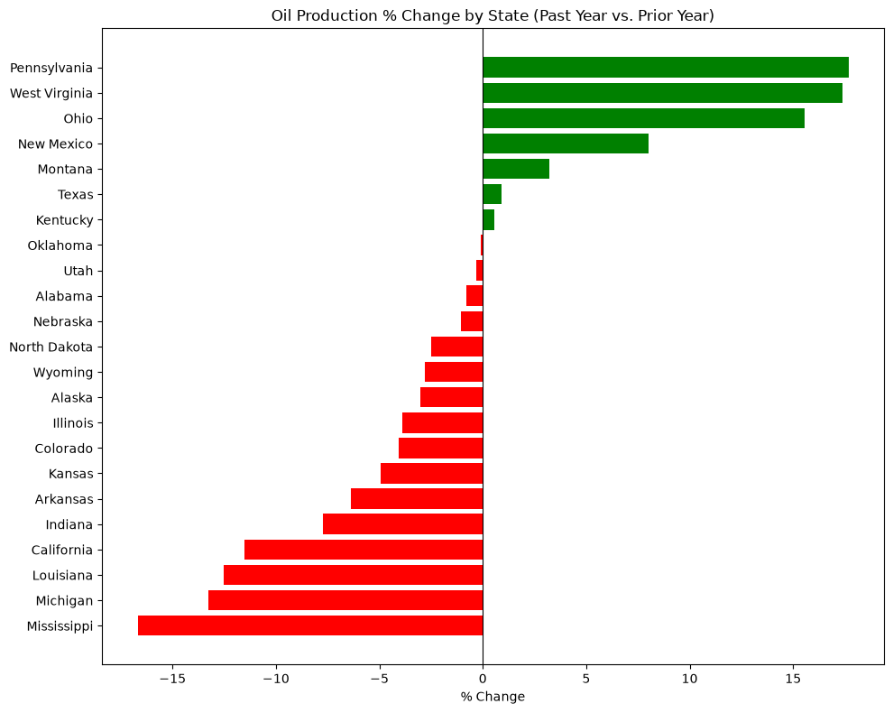
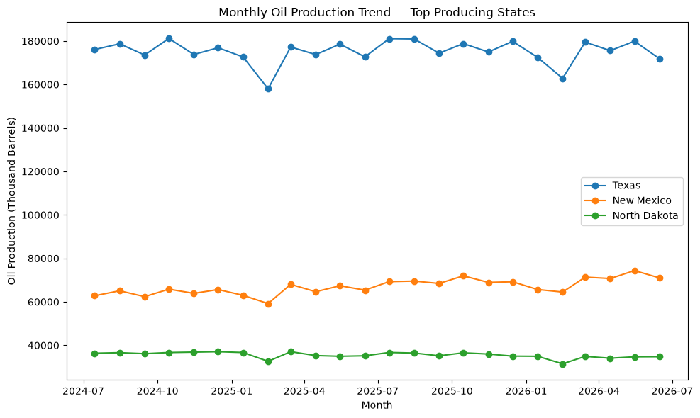

# Oil & Gas Production Trends by State

## Project Overview

A personal research project joining three real datasets — state-level crude oil production, state-level natural gas withdrawals, and a states-to-region reference table — to identify which U.S. states are growing or declining in oil production.

## Business Problem

**Business context:** I built this project to practice a skill that comes up constantly in real analyst jobs: starting from a vague question and figuring out, on my own, what data and approach would actually answer it. I imagined a realistic (but made-up) scenario — a VP of Operations asking *"how have our wells been performing lately vs. last year"* — with no specifics on which wells, what "performing" means, what time period, or what geographic scope. Before touching any data, I worked through what was actually missing from that request (metric, time period, geography, deliverable format) the way a real analyst would need to.

**Imagined stakeholder:** VP of Operations (a made-up scenario used to frame the analysis)

**Questions asked (after clarifying the original vague request):**
- How has oil and natural gas production changed across major producing states over the past year compared to the year before?
- Which states are trending up vs. down?

**Why it matters:** A single national "production is up/down" headline can hide very different state-level stories — knowing exactly which states are growing or declining lets a company target investment, staffing, or partnership decisions at the right places.

## Dataset

- **Sources:** U.S. Energy Information Administration (EIA) — the federal government's official energy data agency
  - Monthly crude oil production by state ([eia.gov/dnav/pet/pet_crd_crpdn_adc_mbbl_m.htm](https://www.eia.gov/dnav/pet/pet_crd_crpdn_adc_mbbl_m.htm))
  - Monthly natural gas gross withdrawals by state ([eia.gov/dnav/ng/ng_prod_sum_a_EPG0_FGW_mmcf_m.htm](https://www.eia.gov/dnav/ng/ng_prod_sum_a_EPG0_FGW_mmcf_m.htm))
  - A states → region (PADD) reference table, built by hand from the groupings already visible in the EIA oil file itself — PADD (Petroleum Administration for Defense District) is a real, official EIA regional classification ([eia.gov's own PADD map](https://www.eia.gov/petroleum/marketing/monthly/paddmap.php))
- **Coverage:** Monthly, current through **June 2026**; analysis focused on the most recent 24 months (July 2024 – June 2026) for a clean year-over-year comparison
- **Size after cleaning:** 768 oil production rows (32 states × 24 months), 384 gas withdrawal rows (16 states × 24 months), 32-row region reference table
- **Limitations:**
  - Only states EIA tracks individually are included — 32 for oil, 16 for gas; smaller-output states are folded into national totals by EIA and aren't broken out.
  - These are production **volumes**, not profitability, cost, or well-count data — a state can be "up" in barrels while still being less profitable, which this data can't show.

## Repository Structure

```
oil-gas-production-trends/
├── data/                                   raw EIA Excel files, derived region reference CSV, and the SQLite database
├── notebooks/                              oil_gas_state_trends.ipynb — full narrated analysis
├── images/                                 exported chart images (used in this README)
├── requirements.txt                        pinned dependencies
└── README.md
```

## How to Run This Project

A full walkthrough from scratch, assuming nothing is installed yet.

**1. Install VS Code.** Download it free from [code.visualstudio.com](https://code.visualstudio.com/) and run the installer.

**2. Install Python.** Download the latest version from [python.org/downloads](https://www.python.org/downloads/). During installation, check the box that says **"Add Python to PATH."**

**3. Install two VS Code extensions.** Open VS Code, click the Extensions icon in the left sidebar (or press `Ctrl+Shift+X`), and install:
   - **Python** (by Microsoft)
   - **Jupyter** (by Microsoft)

**4. Download this project.** Either:
   - Go to [github.com/Shafinzz/oil-gas-production-trends](https://github.com/Shafinzz/oil-gas-production-trends), click the green **"Code"** button → **"Download ZIP"** → unzip it somewhere on your computer, or
   - If you have Git installed: `git clone https://github.com/Shafinzz/oil-gas-production-trends.git`

**5. Open the project folder in VS Code.** File → Open Folder → select the unzipped/cloned `oil-gas-production-trends` folder.

**6. Open a terminal inside VS Code.** Terminal menu → New Terminal.

**7. Install the required Python packages.** In that terminal, run:
```
pip install -r requirements.txt
```

**8. Open the notebook.** In VS Code's file explorer (left sidebar), open `notebooks/oil_gas_state_trends.ipynb`.

**9. Select a Python kernel.** The first time you run a cell, VS Code will ask which Python environment to use — pick the one you just installed Python packages into (the one from step 7).

**10. Run the notebook.** Click **"Run All"** at the top of the notebook, or run each cell individually from top to bottom with `Shift+Enter`. The two raw EIA `.xls` files and the derived `states_region_reference.csv` are already included in `data/`; the SQLite database (`oil_gas.db`) is generated automatically the first time the notebook runs.

## Methodology

1. **Clarifying an intentionally vague business request** — before touching data, worked through what was actually being asked: which metric ("performing" = production volume), what time period (last 12 months vs. the 12 before), what geography (state-level, since that's the finest level EIA publishes cleanly and currently), and what format (a few clear visuals, not a raw table, since this is bound for a board meeting).
2. **Loading and cleaning two real Excel sources** — both files needed `header=2` (the real headers sit below two junk rows) and careful column filtering: the crude oil file mixes 5 regional (PADD) subtotals, a national total, 2 offshore columns, and a nested Alaska sub-total trap (`Alaska`, `Alaska South`, `Alaska North Slope`, where the latter two are sub-pieces of Alaska's own total) in among the real state columns. Used an **allow-list** of the real state names — deliberately chosen over an exclude-keyword filter, since the Alaska trap wouldn't have been caught by any simple keyword exclusion rule.
3. **Reshaping wide data into long data** — both files originally had one column per state; reshaped with `pandas.melt()` into one row per state per month, the format needed for SQL work.
4. **Building a 3rd table by hand** — a states → region (PADD) reference table, derived directly from the real regional groupings visible in the EIA file's own column structure.
5. **Loading all 3 tables into SQLite** and joining them with real SQL: a straightforward JOIN to attach region to each oil row, then a **LEFT JOIN** (matched on both State and Date) to attach gas data — LEFT JOIN specifically because an INNER JOIN would have silently dropped all 16 oil-only states that don't produce gas.
6. **Labeling periods with `CASE WHEN`**, then aggregating with `.groupby()` and reshaping with `.pivot()` to get one row per state with both "Prior Year" and "Recent Year" totals side by side.
7. **Reliability filtering before trusting any percentage** — caught that tiny-volume states (e.g., Arizona going from 1 to 2 barrels = "+100%") produce meaningless percentages; filtered to states with at least 1,000 thousand barrels of prior-year production before drawing conclusions, the same discipline as flagging small sample sizes in EDA work.

## Key Findings

- **New Mexico is the strongest real grower among major producers: +8.0%** (773,102 → 834,982 thousand barrels, a genuine gain of ~61,880 thousand barrels) — consistent with the well-documented Permian Basin growth story.
- **Texas is essentially flat (+0.9%)** — but because Texas is so dominant in scale, that "flat" percentage still represents the single largest raw increase of any state (~19,000 thousand barrels).
- **Pennsylvania (+17.7%), West Virginia (+17.4%), and Ohio (+15.5%)** show the strongest *relative* growth of any state — a real signal of renewed Appalachian-region activity, even though their absolute volumes are much smaller than Texas or New Mexico.
- **Mississippi (-16.7%), Michigan (-13.3%), Louisiana (-12.5%), and California (-11.5%)** show real, meaningful declines.
- **The Gulf Coast region dominates U.S. oil production**, producing roughly 4.5x more than the next-largest region (Midwest) in the most recent 12 months.

### Visualizations

**Production by region:**


**Which states are trending up vs. down:**


**Monthly trend for the top movers:**


## Deeper Analysis: A February Dip That Wasn't Real

The trend chart above shows what looks like a dip every February. My first instinct was to wonder if this reflected a real event (e.g., a winter storm disrupting production) — 28 of 32 states did show a decline from January to February 2025.

But checking the data more carefully caught something important: **February only has 28 days, while most other months have 30 or 31.** Once production is converted to a *daily rate* instead of a raw monthly total, the dip completely disappears — February 2025's daily rate (11,483 barrels/day) and February 2026's (11,714 barrels/day) are both entirely normal, right in line with every other month in the dataset (which range roughly 11,200–11,900/day).

**What this means:** the apparent February dip was a calendar artifact, not a real production event. This is a good reminder to double-check *why* a pattern exists before drawing a conclusion from it — reporting "production dropped due to a possible weather event" to a board without this check would have been a real, embarrassing mistake.

*Note: the day-count normalization code isn't in the notebook yet — this finding was verified separately and is a planned addition for a future session.*

## Business Recommendations

- **Prioritize New Mexico for near-term investment/expansion attention** — it's the only major producer combining a large absolute base with genuine, sustained growth.
- **Investigate what's driving the Appalachian growth** (Pennsylvania, West Virginia, Ohio) — while individually smaller than the Gulf Coast giants, a consistent regional growth signal across three neighboring states is worth understanding, since it could represent an emerging opportunity.
- **Flag Mississippi, Michigan, Louisiana, and California for a closer look** — their declines are large enough to be real signals, not noise, and merit follow-up on root cause.
- **Don't over-read month-to-month swings without checking for calendar effects first** — as demonstrated by the February finding above.

## Tools Used

- Python (pandas, matplotlib)
- SQLite (via Python's built-in `sqlite3`)
- SQL (`JOIN`, `LEFT JOIN`, multi-column `ON` conditions, `CASE WHEN`, `GROUP BY`)
- Jupyter Notebook (via VS Code)

## Limitations

- Production volume alone doesn't capture profitability, well count, or operating cost — a state could be "up" in barrels while becoming less profitable per barrel.
- Only 32 states (oil) / 16 states (gas) are covered — EIA doesn't break out smaller producers individually.
- Percentage comparisons are only meaningful for states with substantial production; smaller states were explicitly filtered out of the headline ranking for this reason.

## References

- U.S. Energy Information Administration. [Crude Oil Production, Monthly](https://www.eia.gov/dnav/pet/pet_crd_crpdn_adc_mbbl_m.htm). Accessed September 2026.
- U.S. Energy Information Administration. [Natural Gas Gross Withdrawals, Monthly](https://www.eia.gov/dnav/ng/ng_prod_sum_a_EPG0_FGW_mmcf_m.htm). Accessed September 2026.
- U.S. Energy Information Administration. [PADD (Petroleum Administration for Defense District) Map](https://www.eia.gov/petroleum/marketing/monthly/paddmap.php) — the official regional classification used to build this project's states-to-region reference table.

## Future Improvements

- Add the days-in-month normalization check directly into the notebook (currently documented as a finding above, not yet coded step by step).
- Extend the same year-over-year comparison to natural gas production, not just oil.
- Investigate the Appalachian region's growth driver directly (new drilling permits? price changes? a specific field coming online?).
- Add a rolling 3-month average to smooth out month-to-month noise before computing trend direction.
